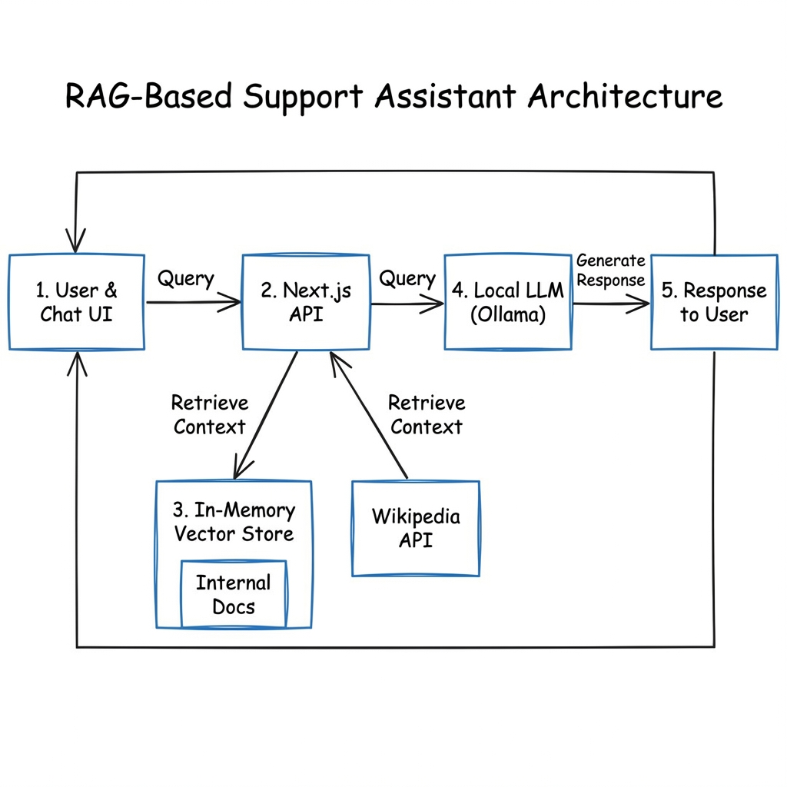

# RAG-Based Support Assistant: Project Report

## 1. Executive Summary
This project is a **Retrieval-Augmented Generation (RAG) Support Assistant** designed to resolve technical support queries by combining private internal documentation with public knowledge. The system is built for **privacy and autonomy**, utilizing local Large Language Models (LLMs) via Ollama to ensure no sensitive internal data leaves the user's infrastructure.

## 2. Technology Stack

### Frontend & Application Framework
-   **Framework**: [Next.js 14+](https://nextjs.org/) (App Router) - For robust server-side rendering and API handling.
-   **Language**: **TypeScript** - Ensuring type safety across the full stack.
-   **Styling**: **Tailwind CSS v4** - Implementing a unified, premium design system with dark mode support.
-   **UI Components**: Functional components with **Lucide React** icons.

### AI & RAG Engine
-   **Orchestration**: **LangChain.js** - Manages the retrieval and generation workflow.
-   **LLM Runtime**: **Ollama** (Local) - Runs the inference engine on the host machine.
    -   **Chat Model**: `llama3` (Meta Llama 3) - High-performance general reasoning.
    -   **Embedding Model**: `nomic-embed-text` - Optimized for text embedding and retrieval.
-   **Vector Store**: **Custom In-Memory Store** - A lightweight, zero-dependency implementation using cosine similarity for fast local retrieval.

## 3. System Architecture

The application follows a monolithic Next.js architecture where the frontend and backend logic reside in the same project but are logically separated.

### Data Flow
1.  **User Query**: The user sends a troubleshooting request via the Chat UI.
2.  **Context Retrieval**:
    *   **Internal**: The system searches the **In-Memory Vector Store** for relevant chunks from the `docs/` folder.
    *   **External**: Simultaneously, it queries **Wikipedia** for broader definitions.
3.  **Prompt Construction**: The system combines the user query + internal docs + Wiki snippets into a strict system prompt.
4.  **Inference**: This prompt is sent to **Ollama (Llama 3)** running locally.
5.  **Response**: The generated answer is streamed back to the frontend with source citations.

## 4. Key Features

### 🔒 Privacy-First Design
By switching to **Ollama**, the application operates entirely offline (after initial model download). This is critical for enterprise use cases where "internal tools" and "runbooks" contain confidential network configurations or passwords.

### 📚 Hybrid Search Strategy
The system intelligently merges information from two distinct sources:
1.  **Internal Knowledge Base**: Recursively scans the `docs/` directory for `.txt` and `.md` files (e.g., Runbooks, Troubleshooting Guides).
2.  **External Knowledge**: Queries the Wikipedia API in real-time to define public terms or broader concepts that might not be in the internal docs.

### ⚡ Zero-Dependency Vector Store
To avoid the complexity of managing external vector databases (like Pincone or Weaviate) for a local tool, we implemented a custom **SimpleVectorStore**.
-   **Mechanism**: Computes embeddings on startup and performs Cosine Similarity search in-memory.
-   **Benefit**: drastically reduces setup time and operational overhead.

## 5. Workflow Description
1.  **Ingestion**: On app start (or first query), the system traverses the `docs/` folder, splits text into chunks, and generates vector embeddings.
2.  **Retrieval**: When a user asks a question, the system converts it to a vector and finds the top 3 most similar chunks from local files.
3.  **Augmentation**: Parallel to local search, it fetches relevant Wikipedia snippets.
4.  **Generation**: A strict system prompt instructs Llama 3 to prioritize internal documents and cite sources before generating the final answer.
